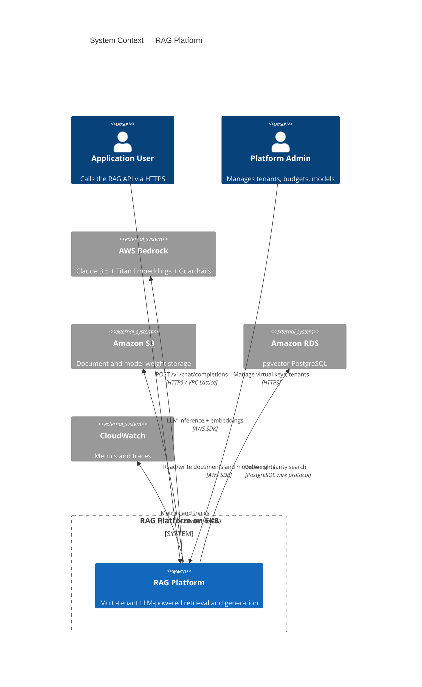
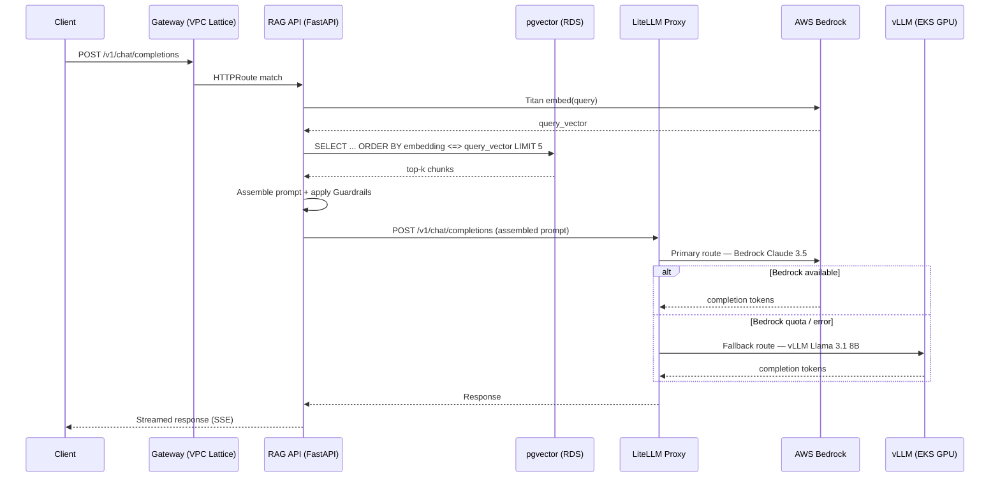
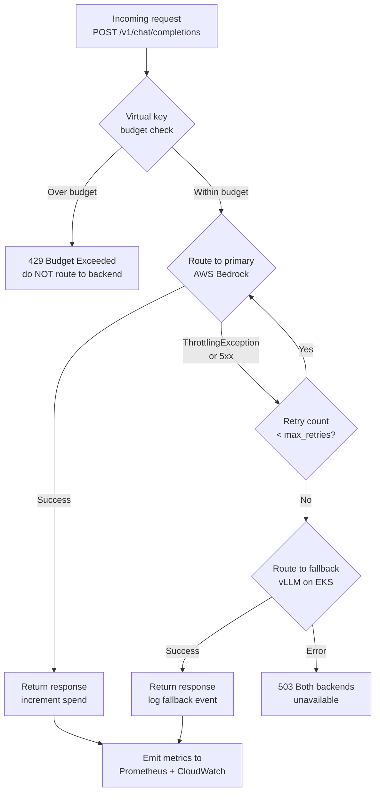
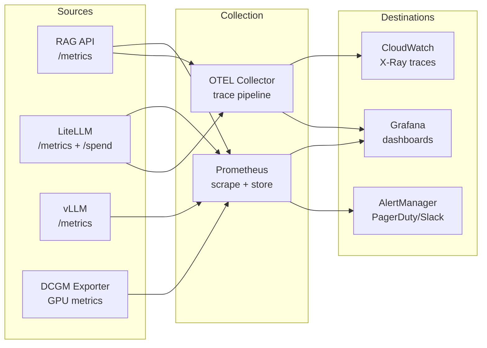

# CLAUDE.md — Production RAG Platform on EKS

This file provides guidance to Claude Code when working with code in this repository.

---

## What this is

A production-grade, multi-tenant RAG (Retrieval-Augmented Generation) platform running on Amazon EKS.
It demonstrates a complete AI Platform Engineering reference implementation:

- Dual-backend LLM routing (AWS Bedrock primary, vLLM self-hosted fallback)
- Kubernetes Gateway API with AWS VPC Lattice (post-Ingress era networking)
- EKS Pod Identity replacing IRSA across all application workloads
- Per-tenant isolation: PostgreSQL schemas, LiteLLM virtual keys, Kubernetes namespaces
- Full LLM observability: latency, token spend, GPU utilisation, distributed tracing

Built as a portfolio-grade project demonstrating enterprise AI Platform Architecture patterns.

---

## Stack

| Layer | Technology |
|---|---|
| Kubernetes | EKS 1.35, Karpenter (CPU + GPU NodePools) |
| Gateway | Kubernetes Gateway API + AWS Gateway API Controller (VPC Lattice) |
| LLM Router | LiteLLM Proxy (OpenAI-compatible, Kubernetes Deployment) |
| LLM Primary | AWS Bedrock (Claude 3.5 Sonnet + Titan Embeddings + Guardrails) |
| LLM Fallback | vLLM (Llama 3.1 8B, EKS GPU nodes, AWS DLC image) |
| RAG API | FastAPI on EKS (query rewriting, retrieval, prompt assembly, streaming) |
| Vector store | pgvector on RDS PostgreSQL (HNSW index, multi-tenant schemas) |
| Document store | S3 (raw docs, chunked text, metadata) |
| Ingestion | Kubernetes CronJob (chunking → Titan embedding → pgvector upsert) |
| Observability | Prometheus + Grafana + OpenTelemetry Collector + CloudWatch |
| IaC | Terraform (terraform-aws-modules/eks, aws-ia/eks-blueprints-addons) |
| AWS auth | EKS Pod Identity for all application workloads |
| Language | Python 3.13 + uv, type hints everywhere |
| Node OS | AL2023 (CPU nodes), Bottlerocket Accelerated (GPU nodes) |
| AWS region | ap-southeast-2 |

---

## Repository layout

```
rag-platform-eks/
│
├── .github/
│   ├── workflows/
│   │   ├── ci.yml                      # Lint, test, docker build on PR
│   │   ├── tf-validate.yml             # terraform fmt + validate + tflint on PR
│   │   └── release.yml                 # Tag-triggered image push to ECR
│   ├── ISSUE_TEMPLATE/
│   │   ├── bug_report.md
│   │   └── feature_request.md
│   └── pull_request_template.md
│
├── terraform/
│   ├── bootstrap/                      # S3 state bucket + DynamoDB lock — run once only
│   ├── eks/                            # Cluster, VPC, Karpenter, EKS add-ons
│   ├── rds/                            # RDS PostgreSQL + pgvector extension
│   ├── iam/                            # Pod Identity IAM roles (app workloads only)
│   └── addons/                         # Gateway API Controller, Prometheus stack, KEDA
│
├── helm/
│   ├── rag-api/                        # FastAPI RAG service Helm chart
│   ├── litellm/                        # LiteLLM Proxy + routing config
│   ├── vllm/                           # vLLM GPU Deployment + PVC + KEDA ScaledObject
│   └── ingestion/                      # CronJob ingestion pipeline
│
├── src/
│   ├── rag_api/                        # FastAPI application
│   │   ├── routers/
│   │   ├── services/                   # retrieval, embedding, guardrails, llm_client
│   │   └── tests/
│   └── ingestion/                      # Chunking + embedding pipeline
│       └── tests/
│
├── k8s/
│   ├── gateway/                        # GatewayClass, Gateway, HTTPRoute, AuthPolicy
│   └── keda/                           # ScaledObject for vLLM queue depth
│
├── scripts/                            # uv-managed automation — no make required
│   ├── provision.py                    # Full stack up (terraform + helm)
│   ├── destroy.py                      # Full stack down
│   ├── ecr_setup.py                    # Create ECR repos + docker login (once per session)
│   ├── docker_build.py                 # Build and push all images
│   ├── benchmark.py                    # vLLM / LiteLLM load testing
│   └── tf_validate.py                  # terraform fmt + validate + tflint
│
├── dashboards/                         # Grafana JSON exports (version-controlled)
│
└── docs/
    ├── adr/                            # Architecture Decision Records (immutable log)
    │   ├── README.md                   # ADR index and status summary
    │   ├── _template.md                # Blank ADR template
    │   ├── ADR-001-llm-routing-strategy.md
    │   ├── ADR-002-vector-database-selection.md
    │   ├── ADR-003-gateway-api-controller.md
    │   ├── ADR-004-eks-pod-identity-over-irsa.md
    │   ├── ADR-005-vllm-model-serving.md
    │   └── ADR-006-multi-tenant-isolation-model.md
    │
    ├── architecture/                   # Mermaid diagrams — all diagrams live here
    │   ├── 01-system-context.md        # C4 Level 1: external users + system boundary
    │   ├── 02-container-diagram.md     # C4 Level 2: services and data stores
    │   ├── 03-request-flow.md          # Sequence: RAG query end-to-end
    │   ├── 04-ingestion-flow.md        # Sequence: document ingestion pipeline
    │   ├── 05-llm-routing.md           # Flowchart: LiteLLM routing + fallback logic
    │   ├── 06-infrastructure.md        # Graph: AWS VPC, EKS, RDS, VPC Lattice, S3
    │   ├── 07-multi-tenancy.md         # Graph: tenant isolation model
    │   └── 08-observability.md         # Flowchart: metrics, traces, alerting pipeline
    │
    ├── runbooks/                       # Operational playbooks for known failure modes
    │   ├── gpu-node-troubleshooting.md
    │   ├── bedrock-quota-exhausted.md
    │   ├── pgvector-slow-queries.md
    │   └── litellm-fallback-triggered.md
    │
    ├── build-plan.md                   # Step checklist — tick as each step completes
    ├── decisions.md                    # Per-component reasoning and learning notes
    └── cost-model.md                   # AWS cost breakdown + optimisation levers
```

---

## Commands

Developer scripts live in `scripts/` and are run via `uv run scripts/<name>.py`. No `make` required.

```bash
# Python / application
uv run scripts/test.py                                     # full test suite
uv run scripts/test.py src/rag_api/tests/test_foo.py::bar  # single test
uv run scripts/lint.py                                     # ruff check + mypy
uv run scripts/fmt.py                                      # ruff format

# Docker
uv run scripts/ecr_setup.py                                # create ECR repos + docker login (once per session)
REGISTRY=<ecr-uri> uv run scripts/docker_build.py         # build + push all images

# Terraform
uv run scripts/tf_validate.py                              # fmt + validate + tflint
uv run scripts/tf_plan.py                                  # terraform plan (all modules)

# Full stack
uv run scripts/provision.py                                # terraform apply + helm installs
uv run scripts/destroy.py                                  # helm uninstall + terraform destroy

# Benchmarking
uv run scripts/benchmark.py --endpoint <litellm-url>       # load test against LiteLLM proxy
```

---

## Key design constraints

- **AWS auth:** EKS Pod Identity (`aws_eks_pod_identity_association`) for all application workloads.
  IRSA is used **only** for EKS system add-ons that don't yet support Pod Identity (VPC CNI, EBS CSI).
  Never use static credentials. Never annotate service accounts manually.
- **Kubernetes version:** 1.35. Never reference deprecated APIs. No `v1beta1`. No Ingress resources.
- **Gateway API only:** All routing via `HTTPRoute`. Ingress NGINX is retired (March 2026).
- **Node AMIs:** AL2023 for CPU nodes, Bottlerocket Accelerated for GPU nodes (Karpenter `amiFamily`).
- **Multi-tenancy:** Each tenant gets an isolated PostgreSQL schema, a LiteLLM virtual key with budget
  cap, and a Kubernetes namespace. Zero cross-tenant data access.
- **No static credentials:** No IAM keys in code, env files, or Kubernetes Secrets.
- **Terraform tags:** All resources must include `var.tags`. Every module must have `variables.tf`
  and `outputs.tf`.
- **Terraform state:** S3 + DynamoDB lock in `terraform/bootstrap/`. Bootstrap is run once and
  is never touched by `provision.py` or `destroy.py`.
- **Python:** Type hints on all function signatures. No bare `except` clauses.
  Use `uv add` for dependencies — never `pip install`.
- **Containers:** Non-root user, multi-stage builds, images pushed to ECR.
- **Admission webhooks:** `failurePolicy: Ignore` — never block workload creation on enforcer failure.

---

## AWS conventions

- **Region:** `ap-southeast-2`
- **Resource name prefix:** `var.name_prefix`
- **Terraform state backend:** S3 + DynamoDB lock (`terraform/bootstrap/backend.tf`)
- **Pod Identity module:** `terraform-aws-modules/eks-pod-identity/aws` v2.5.0
- **EKS Blueprints Addons module:** `aws-ia/eks-blueprints-addons/aws` v1.23.0
- **EKS module:** `terraform-aws-modules/eks/aws` (latest)

---

## EKS Pod Identity — usage pattern

```hcl
module "rag_api_pod_identity" {
  source  = "terraform-aws-modules/eks-pod-identity/aws"
  version = "2.5.0"

  name                    = "${var.name_prefix}-rag-api"
  attach_custom_policy    = true
  source_policy_documents = [data.aws_iam_policy_document.rag_api.json]

  associations = {
    rag-api = {
      cluster_name    = module.eks.cluster_name
      namespace       = "rag-platform"
      service_account = "rag-api"
    }
  }

  tags = var.tags
}
```

No OIDC provider setup. No service account annotation. Association managed via EKS API only.

---

## LiteLLM routing conventions

- Bedrock is always the `primary` model group. vLLM is `fallback`.
- All routing config lives in `helm/litellm/config.yaml`, mounted as a ConfigMap.
- Virtual keys are created per tenant with `max_budget` and `rpm_limit`.
- Cost tracking enabled — all token spend logged and exposed via `/spend`.
- Fallback chain: Bedrock → vLLM. If both fail, return 503. Never silently drop requests.

---

## vLLM conventions

- Model weights in S3, pulled by an init container at pod start (no model baked into image).
- AWS DLC image: `763104351884.dkr.ecr.ap-southeast-2.amazonaws.com/vllm-inference:latest`
- GPU NodePool: `g5` family (A10G), spot with on-demand fallback (60–70% cost reduction).
- KEDA `ScaledObject` targets `vllm:num_requests_waiting` — scale on queue depth, not CPU.
- KEDA scale-to-zero enabled on GPU nodes to eliminate idle GPU cost.
- `--tensor-parallel-size` set as env var — change without image rebuild.

---

## Observability conventions

- Prometheus scrapes: vLLM `/metrics`, LiteLLM `/metrics`, RAG API `/metrics`, DCGM exporter.
- Alert thresholds: `vllm:num_requests_waiting > 10`, `vllm:gpu_cache_usage_perc > 90`.
- OpenTelemetry Collector forwards traces to CloudWatch X-Ray and spans to Grafana Tempo.
- Per-tenant cost dashboards from LiteLLM `/spend/logs` API.
- All Grafana dashboards exported to `dashboards/` as JSON and version-controlled.

---

## Testing conventions

- **Python:** `pytest` with `moto` for AWS service mocking. Tests in `src/<component>/tests/`.
- **Terraform:** `terraform fmt` → `terraform validate` → `tflint` before any `terraform plan`.
- **Local K8s:** `kind` for admission webhook and operator tests (no EKS required).
- **LLM mocking:** Local vLLM instance or OpenAI-compatible stub in CI.

---

## Documentation standards

### Architecture Decision Records (ADRs)

An ADR is a short document that captures and explains a single decision. It should contain the decision, the context for making it, and significant ramifications. ADRs should not be modified if the decision changes — instead write a new one and link it as a superseding record.

ADRs are the **primary record of why** this system is built the way it is.
Every significant technology selection, isolation model, or security boundary needs one.

**File:** `docs/adr/ADR-NNN-short-slug.md`

**Template** (copy from `docs/adr/_template.md`):

```markdown
# ADR-NNN: <Decision title>

**Date:** YYYY-MM-DD
**Status:** Proposed | Accepted | Superseded by ADR-NNN
**Deciders:** Girish Narayanan

## Context
What situation forces this decision? What forces are in play?

## Decision
What was decided? State it in one or two sentences.

## Options considered

| Option | Pros | Cons |
|---|---|---|
| Option A | ... | ... |
| Option B | ... | ... |

## Consequences
What becomes easier or harder? What risks does this introduce?

## References
- Link to relevant docs, benchmarks, or prior art
```

**Rules:**
- Write the ADR **before** implementing. Articulating the decision forces understanding.
- Once Accepted, **never edit**. If the decision changes, write a new ADR and mark the old
  one as `Superseded by ADR-NNN`.
- The ADR index at `docs/adr/README.md` must be kept current with every new ADR.

**Pre-written ADRs for this project** (write these before Week 1 begins):

| ADR | Decision |
|---|---|
| ADR-001 | LiteLLM as dual-provider LLM router (Bedrock primary, vLLM fallback) |
| ADR-002 | pgvector on RDS over Weaviate or OpenSearch as vector store |
| ADR-003 | AWS Gateway API Controller over Kong or Envoy Gateway |
| ADR-004 | EKS Pod Identity over IRSA for application workload IAM |
| ADR-005 | vLLM over SageMaker or Triton for self-hosted GPU inference |
| ADR-006 | Namespace + schema + virtual key as the three-layer tenant isolation model |

---

### Architecture diagrams

All diagrams are Mermaid-based and live in `docs/architecture/`. Each file is self-contained
Markdown — fully editable in GitHub, VS Code, and the Mermaid live editor (mermaid.live).

**Diagram set:**

| File | Diagram type | What it shows |
|---|---|---|
| `01-system-context.md` | C4 Context | External actors, system boundary, AWS services |
| `02-container-diagram.md` | C4 Container | Internal services, data stores, relationships |
| `03-request-flow.md` | Sequence | End-to-end RAG query from client to response |
| `04-ingestion-flow.md` | Sequence | Document chunking → embedding → pgvector upsert |
| `05-llm-routing.md` | Flowchart | LiteLLM routing decision tree and fallback logic |
| `06-infrastructure.md` | Graph | VPC, subnets, EKS, RDS, VPC Lattice, S3 |
| `07-multi-tenancy.md` | Graph | Tenant isolation: namespace, schema, virtual key |
| `08-observability.md` | Flowchart | Metrics, traces, and alerting pipeline |

**Diagram conventions:**
- One concern per diagram. Never combine infrastructure and sequence in one diagram.
- Every diagram file has a title and a one-paragraph prose description above the code block.
- Use `%%` comments to add section labels inside complex diagrams.
- When a component changes, update the affected diagram(s) in the same PR.

**Starter diagrams** (populate each `docs/architecture/` file with these):

**01-system-context.md**


**03-request-flow.md**


**05-llm-routing.md**


**08-observability.md**


---

### Runbooks

`docs/runbooks/` contains operational playbooks for known failure modes. Each runbook covers:
symptoms, cause, investigation steps, and resolution. Required runbooks:

- `gpu-node-troubleshooting.md` — Karpenter not provisioning GPU nodes, OOMKilled vLLM pods
- `bedrock-quota-exhausted.md` — Bedrock throttling, verifying fallback is triggered correctly
- `pgvector-slow-queries.md` — HNSW index degradation, connection pool exhaustion
- `litellm-fallback-triggered.md` — How to diagnose which backend is serving and why

**Runbook template:**
```markdown
# Runbook: <Title>

## Symptoms
What does the operator observe? (alerts firing, error rates, user reports)

## Likely cause
Most common root cause for this symptom set.

## Investigation steps
1. Step one — exact command or query to run
2. Step two — what to look for in the output

## Resolution
Exact steps to resolve. Include rollback if applicable.

## Prevention
What change prevents recurrence?
```

### Cost model (`docs/cost-model.md`)

Documents estimated monthly AWS cost by component at a defined baseline load, plus the levers
available to reduce cost. This is a portfolio differentiator — most candidates cannot discuss cost.

Minimum content:
- Per-component cost table (EKS cluster, GPU nodes, RDS, Bedrock tokens, S3, VPC Lattice)
- Baseline load assumption (e.g. 100 RAG queries/day, 1,000 documents ingested)
- Optimisation levers and their estimated savings (Karpenter spot, scale-to-zero, RDS rightsizing,
  Bedrock provisioned throughput vs on-demand at volume)

---

## Working pattern

Two living documents in `docs/`:

- **`docs/build-plan.md`** — step checklist. Tick boxes as each step completes.
- **`docs/decisions.md`** — reasoning, tradeoffs, and learning notes per component.

**Before building each step:** write the ADR and populate `decisions.md` first.
**After building:** tick the checklist in `build-plan.md`.

**Keep `README.md` current with every change.** Add, remove, or rename anything → update README
in the same response. The README is the primary portfolio document; stale steps lose credibility.

---

## Learning objectives

This project is structured to build genuine depth. Each component has explicit learning goals
and deliberate exercises that go beyond getting it to work.

### How to approach each component

1. Write the ADR first — articulating the decision forces understanding of why, not just how.
2. Write the `decisions.md` section: alternatives considered, tradeoffs made.
3. Implement the minimum working version.
4. **Deliberately break it** — understand the failure mode, write the runbook entry.
5. Add observability — a component is not done until it is visible in Grafana.

---

### Week 1 — EKS, Karpenter, Pod Identity

**Learning goals:**
- Understand the full Karpenter NodePool lifecycle: pending pod → node provisioned →
  workload scheduled → node consolidated. Read the `karpenter.sh/v1` API spec, not tutorials.
- Understand why Pod Identity is architecturally better than IRSA: no per-cluster OIDC,
  reusable roles, ABAC via session tags. Write ADR-004 before provisioning anything.
- Understand EKS add-on version pinning vs `most_recent = true` and why it matters in prod.

**Deliberate exercises:**
- Deploy a pod with GPU resource requests to a cluster with zero GPU nodes. Watch Karpenter
  provision a `g5` node. Delete the pod. Watch consolidation and scale-down. Note the timing.
- Exec into a pod with a Pod Identity association. Run `aws sts get-caller-identity`. Verify the
  role ARN. Then delete the association and confirm the exact error the SDK returns.
- Intentionally misconfigure a NodePool (wrong `amiFamily` for GPU). Read Karpenter controller
  logs. Understand how scheduling failures are surfaced.

---

### Week 2 — vLLM, LiteLLM, GPU inference

**Learning goals:**
- Understand PagedAttention and continuous batching — why vLLM throughput is higher than naive
  serving. Map these concepts directly to the Prometheus metrics the project exposes.
- Understand LiteLLM's routing model: model groups, retry logic, fallback chains, virtual keys,
  spend tracking. Read the config reference, not just copy-paste examples.
- Understand why `num_requests_waiting` is a better KEDA scale signal than CPU for GPU inference:
  GPU utilisation is not CPU-bound, it is batch-bound.

**Deliberate exercises:**
- Benchmark vLLM directly, then via LiteLLM routing to vLLM, then via LiteLLM to Bedrock.
  Compare latency P50/P95/P99. Document the differences and overhead in `decisions.md`.
- Exhaust a LiteLLM virtual key budget. Verify the 429 response. Verify the Bedrock fallback
  is NOT triggered (budget exhaustion is not a backend error — understand this distinction).
- Force a vLLM OOM by sending a request with a very long context. Observe the pod restart.
  Write the runbook entry for this failure mode.

---

### Week 3 — RAG API, Gateway API, pgvector

**Learning goals:**
- Understand HNSW index parameters (`m`, `ef_construction`, `ef_search`) and their effect on
  recall vs query latency. Run `EXPLAIN ANALYZE` in PostgreSQL to confirm index usage.
- Understand the Gateway API resource hierarchy: `GatewayClass` → `Gateway` → `HTTPRoute` →
  `BackendRef`. Understand why this separation of concerns (infra vs app ownership) is a
  structural improvement over the old Ingress model.
- Understand VPC Lattice service network model and how it differs from a traditional ALB.

**Deliberate exercises:**
- Insert a known document and query for it. Measure top-k recall at k=3, k=5, k=10. Tune
  `ef_search`. Document the latency/recall tradeoff in `decisions.md`.
- Add an `HTTPRoute` traffic weight split (90/10 between two RAG API versions). Verify the
  split with Prometheus metrics. This demonstrates canary deployment — a key enterprise pattern.
- Intentionally misconfigure the pgvector HNSW index (wrong `vector_dims`). Observe the error.
  Understand the migration path when the embedding model changes.

---

### Week 4 — Observability, ingestion, hardening

**Learning goals:**
- Map the four golden signals (latency, traffic, errors, saturation) to specific Prometheus
  metrics in this stack. Build one Grafana dashboard panel per signal.
- Understand OpenTelemetry's data model: traces, spans, W3C TraceContext propagation. Trace a
  single RAG request from Gateway → RAG API → LiteLLM → Bedrock. Verify in CloudWatch X-Ray.
- Understand PodDisruptionBudgets and why they matter during Karpenter node consolidation.
  Without a PDB, consolidation causes request drops mid-flight.

**Deliberate exercises:**
- Add artificial latency to the Titan embedding call. Verify it shows up as a long span in the
  RAG API trace. Write a Prometheus alert for embedding latency > 500ms.
- Delete a node that has running RAG API pods. Observe what happens with and without a PDB.
  Document the difference — this is a real production incident pattern.
- Run the ingestion pipeline against 1,000 documents. Measure throughput. Identify the bottleneck
  (embedding calls vs pgvector writes vs S3 reads). Tune and document the result.

---

## Enterprise portfolio presentation

The `README.md` is a portfolio document as much as a technical guide. It must contain:

1. **Problem statement** — one paragraph: what problem does this platform solve?
2. **Architecture diagram** — embed the rendered Mermaid container diagram or link to it.
3. **Key engineering decisions** — bullet list linking to ADRs. Example:
   _"Why vLLM over SageMaker? [ADR-005](docs/adr/ADR-005-vllm-model-serving.md)"_
   This signals architectural thinking, not just implementation ability.
4. **Operational maturity signals** — mention runbooks, cost model, and observability dashboards.
5. **Honest status table** — what is implemented vs in progress. Unfinished items with reasoning
   are more credible than an inflated feature list.

The GitHub repository itself should have:
- Branch protection on `main` (require PR + CI pass before merge)
- GitHub Actions CI: lint, test, and `tf validate` on every PR
- Issue templates for bugs and features
- Semantic versioning tags on releases

---

## Build sequence

### Bootstrap (once only)

1. `terraform/bootstrap/` — S3 state bucket + DynamoDB lock table
2. Write all six ADRs in `docs/adr/` before writing any Terraform

### Week 1 — Infrastructure foundation

3. `terraform/eks/` — VPC, EKS 1.35, Karpenter (CPU NodePool + GPU NodePool)
4. `terraform/rds/` — RDS PostgreSQL + pgvector extension + parameter group
5. `terraform/iam/` — Pod Identity roles for all app workloads
6. `terraform/addons/` — AWS Gateway API Controller, kube-prometheus-stack, KEDA, metrics-server

### Week 2 — LLM serving layer

7. `helm/vllm/` — Deployment, PVC, GPU tolerations, KEDA ScaledObject
8. `helm/litellm/` — LiteLLM Proxy, routing config, virtual key bootstrap

### Week 3 — RAG API and gateway wiring

9. `src/rag_api/` — FastAPI: query rewriting, embedding, retrieval, guardrails, streaming
10. `helm/rag-api/` — Helm chart
11. `k8s/gateway/` — GatewayClass, Gateway, HTTPRoute, AuthPolicy (VPC Lattice)

### Week 4 — Ingestion, observability, hardening

12. `src/ingestion/` + `helm/ingestion/` — CronJob: S3 → chunk → embed → pgvector
13. `dashboards/` — Grafana: cost, latency, GPU utilisation, Bedrock vs vLLM routing split
14. PodDisruptionBudgets, HPA on RAG API + LiteLLM, Karpenter consolidation policy
15. `docs/runbooks/` — all four runbooks written and linked from README
16. `docs/cost-model.md` — baseline estimate + optimisation levers
