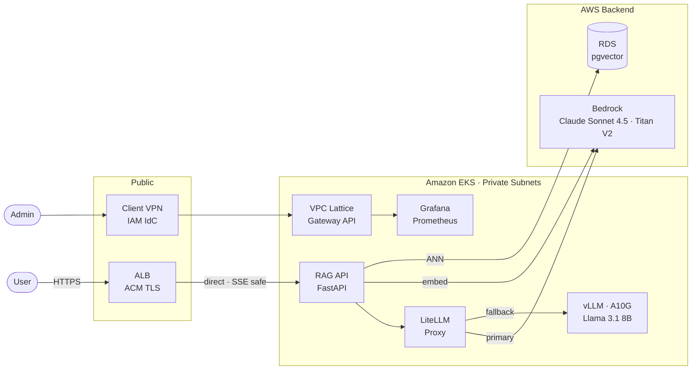

# RAG Platform on EKS

A production-grade, multi-tenant Retrieval-Augmented Generation platform on Amazon EKS.
Built as an AI Platform Engineering reference implementation demonstrating enterprise patterns:
dual-backend LLM routing, Kubernetes Gateway API with VPC Lattice, EKS Pod Identity,
per-tenant isolation, and full LLM observability.

---

## Problem statement

Enterprise teams need to run LLM-powered features against their own private documents without
sending data to third-party APIs. This platform provides a managed, multi-tenant RAG service:
tenants upload documents, the platform indexes them into a vector store, and serves accurate,
grounded answers via an OpenAI-compatible API — all within a single AWS account with hard
per-tenant data and budget isolation.

---

## Architecture



_Ingestion pipeline (not shown): S3 → chunk → Titan embed → pgvector upsert. Full diagrams in [`docs/architecture/`](docs/architecture/)._

---

## Key engineering decisions

| Decision | ADR |
|---|---|
| Custom RAG pipeline over Bedrock Knowledge Bases or framework abstraction | [ADR-001](docs/adr/ADR-001-custom-rag-pipeline-vs-managed-service.md) |
| LiteLLM as dual-provider router (Bedrock primary, vLLM fallback) | [ADR-002](docs/adr/ADR-002-llm-routing-strategy.md) |
| pgvector on RDS over Weaviate or OpenSearch | [ADR-003](docs/adr/ADR-003-vector-database-selection.md) |
| AWS Gateway API Controller (VPC Lattice) over Kong or Envoy | [ADR-004](docs/adr/ADR-004-gateway-api-controller.md) |
| EKS Pod Identity over IRSA for application IAM | [ADR-005](docs/adr/ADR-005-eks-pod-identity-over-irsa.md) |
| vLLM over SageMaker or Triton for GPU inference | [ADR-006](docs/adr/ADR-006-vllm-model-serving.md) |
| Namespace + schema + virtual key as three-layer tenant isolation | [ADR-007](docs/adr/ADR-007-multi-tenant-isolation-model.md) |
| ALB → RAG direct (streaming), VPC Lattice admin only | [ADR-008](docs/adr/ADR-008-network-security-and-defense-in-depth.md) |
| Remove VPC interface endpoints from dev | [ADR-009](docs/adr/ADR-009-remove-vpc-endpoints-dev.md) |

---

## Stack

| Layer | Technology |
|---|---|
| Kubernetes | EKS 1.35, Karpenter (CPU + GPU NodePools) |
| Gateway | Kubernetes Gateway API + AWS Gateway API Controller (VPC Lattice) |
| LLM Router | LiteLLM v1.82.3 (OpenAI-compatible proxy) |
| LLM Primary | AWS Bedrock — Claude Sonnet 4.5 (`au.` inference profile) + Titan Embeddings V2 |
| LLM Fallback | vLLM — Llama 3.1 8B on g5 GPU nodes (Karpenter spot, KEDA scale-to-zero) |
| RAG API | FastAPI on EKS (query rewriting, retrieval, prompt assembly, streaming) |
| Vector store | pgvector on RDS PostgreSQL 16 (HNSW index, per-tenant schemas) |
| Cache | ElastiCache Serverless for Redis (TLS, LiteLLM key + spend cache) |
| Document store | S3 (raw docs, chunked text, model weights) |
| Ingestion | Kubernetes CronJob (chunking → Titan embed → pgvector upsert) |
| Observability | Prometheus + Grafana + ADOT Collector (EKS managed add-on) + CloudWatch X-Ray |
| IaC | Terraform (terraform-aws-modules/eks, eks-blueprints-addons v1.23.0) |
| AWS auth | EKS Pod Identity for all application workloads |
| Language | Python 3.13 + uv |
| AWS region | ap-southeast-2 |

---

## Build status

| Component | Status |
|---|---|
| ADRs (9) | Done |
| Architecture diagrams (8) | Done |
| Runbooks (4) | Done |
| Cost model | Done |
| `terraform/bootstrap` | Done |
| `terraform/eks` (VPC, EKS 1.35, Karpenter CPU + GPU NodePools) | Done |
| `terraform/rds` (PostgreSQL 16 + pgvector) | Done |
| `terraform/elasticache` (Redis Serverless) | Done |
| `terraform/iam` (Pod Identity roles — rag-api, litellm, ingestion, vllm) | Done |
| `terraform/addons` (Gateway API Controller, Prometheus, ADOT, KEDA, metrics-server) | Done |
| `helm/vllm` (GPU Deployment, S3 init container, PVC, KEDA ScaledObject) | Done |
| `helm/litellm` (Bedrock primary → vLLM fallback, RDS + Redis wired, Prisma migrations) | Done |
| `scripts/provision.py` + `destroy.py` (full end-to-end automation) | Done |
| `scripts/bootstrap_keys.py` (per-tenant virtual key seeding) | Done |
| `src/rag_api` (FastAPI RAG service) | Not started |
| `helm/rag-api` | Not started |
| `k8s/gateway` (GatewayClass, HTTPRoute, TargetGroupBinding) | Not started |
| `src/ingestion` (CronJob pipeline) | Not started |
| `helm/ingestion` | Not started |
| Grafana dashboards | Not started |

---

## Prerequisites

- [uv](https://docs.astral.sh/uv/) — Python toolchain
- [Terraform](https://developer.hashicorp.com/terraform/install) >= 1.9
- [AWS CLI](https://docs.aws.amazon.com/cli/latest/userguide/getting-started-install.html) v2 with credentials for `ap-southeast-2`
- [kubectl](https://kubernetes.io/docs/tasks/tools/) + [helm](https://helm.sh/docs/intro/install/)

```bash
uv sync --all-extras
```

---

## Provision

```bash
# 1. Verify AWS credentials
aws sts get-caller-identity

# 2. Bootstrap state backend (once only — creates S3 bucket + DynamoDB lock table)
cd terraform/bootstrap && terraform init && terraform apply && cd -

# 3. Provision everything (EKS → RDS → ElastiCache → IAM → addons → Helm → migrations)
uv run scripts/provision.py --env dev

# On subsequent runs (state backend already exists):
uv run scripts/provision.py --env dev --skip-bootstrap

# 4. Seed per-tenant virtual keys (idempotent)
uv run scripts/bootstrap_keys.py
# Keys saved to infra/virtual-keys.json (gitignored)
```

Retrieve the LiteLLM master key at any time:
```bash
kubectl get secret litellm-env -n rag-platform \
  -o jsonpath='{.data.PROXY_MASTER_KEY}' | base64 -d
```

---

## Test and lint

```bash
uv run scripts/test.py        # pytest (moto for AWS mocks)
uv run scripts/lint.py        # ruff + mypy
uv run scripts/tf_validate.py # terraform fmt + validate + tflint
uv run scripts/benchmark.py --endpoint <alb-dns-name>
```

---

## Destroy

```bash
# Tear down all modules in reverse order (addons → iam → elasticache → rds → eks)
# Bootstrap state backend is preserved by default.
uv run scripts/destroy.py --env dev

# Full teardown including state backend (irreversible — loses all Terraform state)
uv run scripts/destroy.py --env dev --include-bootstrap
```

---

## Operational notes

### Bedrock model selection (ap-southeast-2)

Claude 3.x models go **Legacy** after 30 days of non-use. Claude 4.x requires cross-region
**inference profiles** — direct foundation model IDs fail with "on-demand throughput isn't
supported". Active profiles for ap-southeast-2:

| Profile ID | Model |
|---|---|
| `au.anthropic.claude-sonnet-4-5-20250929-v1:0` | Claude Sonnet 4.5 (Australia) |
| `au.anthropic.claude-sonnet-4-6` | Claude Sonnet 4.6 (Australia) |
| `apac.anthropic.claude-sonnet-4-20250514-v1:0` | Claude Sonnet 4.0 (APAC) |

The `au.` profile routes cross-region (may hit `ap-southeast-4`). IAM policy must use
`arn:aws:bedrock:*::foundation-model/*` (wildcard region) to cover all routing targets.

```bash
aws bedrock list-inference-profiles --region ap-southeast-2
```

### Pod Identity verification

After any Pod Identity change, confirm the pod has the correct role:

```bash
kubectl exec -n rag-platform <pod> -- python -c \
  "import boto3; print(boto3.client('sts', region_name='ap-southeast-2').get_caller_identity()['Arn'])"
```

**Deleting a Pod Identity association does not crash the pod.** It silently falls back to the
EC2 node IAM role — the pod stays `Running`/`Ready`. The failure surfaces only when the pod
calls a service the node role cannot access. Confirmed error:

```
AccessDeniedException: User: arn:aws:sts::<acct>:assumed-role/system-eks-node-group-.../i-...
is not authorized to perform: bedrock:InvokeModel on resource: ...
```

### LiteLLM budget exhaustion

Budget-exhausted virtual keys return **HTTP 400** (`type: "budget_exceeded"`), not 429.
This fires pre-flight — no model call is made and vLLM fallback is **not** triggered.
A Bedrock `ThrottlingException` (5xx) is what triggers fallback.

```json
{"error": {"message": "Budget has been exceeded! Current cost: 0.0, Max budget: 0.0",
           "type": "budget_exceeded", "code": "400"}}
```

---

## Repository layout

```
├── terraform/
│   ├── bootstrap/      S3 state bucket + DynamoDB lock table
│   ├── eks/            VPC, EKS 1.35, Karpenter NodePools
│   ├── rds/            PostgreSQL 16 + pgvector
│   ├── elasticache/    Redis Serverless
│   ├── iam/            Pod Identity roles (rag-api, litellm, ingestion, vllm)
│   ├── addons/         Gateway API Controller, Prometheus, ADOT, KEDA
│   └── environments/   dev.tfvars
├── helm/
│   ├── litellm/        LiteLLM values (Bedrock primary, vLLM fallback)
│   └── vllm/           vLLM Deployment + PVC + Service
├── src/
│   ├── rag_api/        FastAPI RAG service (Week 3)
│   └── ingestion/      Chunking + embedding CronJob (Week 4)
├── k8s/
│   ├── keda/           vLLM ScaledObject
│   └── gateway/        GatewayClass, HTTPRoute, TargetGroupBinding (Week 3)
├── scripts/
│   ├── provision.py        Full stack provisioning (TF + Helm + migrations)
│   ├── destroy.py          Full teardown with correct resource ordering
│   ├── bootstrap_keys.py   Per-tenant LiteLLM virtual key seeding
│   └── exercise_*.py       Deliberate exercises (budget 400, Pod Identity)
├── infra/
│   └── cluster-state.md    Running / Destroyed state — read before starting
├── dashboards/         Grafana JSON exports (Week 4)
└── docs/
    ├── adr/            Architecture Decision Records (9)
    ├── architecture/   Mermaid diagrams (8)
    ├── runbooks/       Operational playbooks (4)
    ├── build-plan.md   Step checklist
    ├── decisions.md    Per-component reasoning + exercise findings
    └── cost-model.md   AWS cost breakdown + optimisation levers
```
