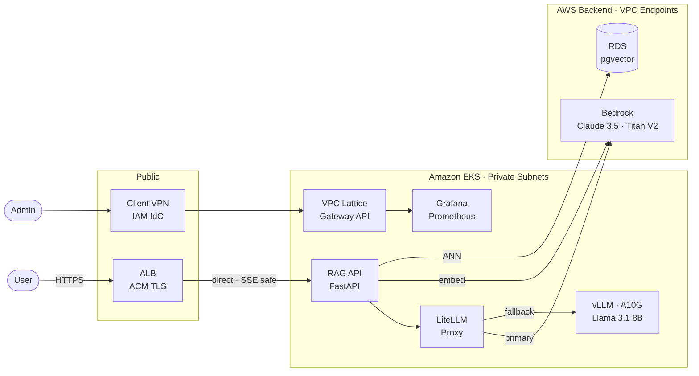

# RAG Platform on EKS

A production-grade, multi-tenant Retrieval-Augmented Generation platform on Amazon EKS.
Built as an AI Platform Engineering reference implementation demonstrating enterprise patterns:
dual-backend LLM routing, Kubernetes Gateway API with VPC Lattice, EKS Pod Identity,
per-tenant isolation, and full LLM observability.

---

## Problem statement

Enterprise teams need to run LLM-powered features against their own private documents without
sending data to third-party APIs. This platform provides a managed, multi-tenant RAG service:
tenants upload documents, the platform indexes them into a vector store, and serves accurate,
grounded answers via an OpenAI-compatible API — all within a single AWS account with hard
per-tenant data and budget isolation.

---

## Architecture



_Ingestion pipeline (not shown): S3 → chunk → Titan embed → pgvector upsert. Full diagrams in [`docs/architecture/`](docs/architecture/)._

---

## Key engineering decisions

| Decision | ADR |
|---|---|
| Custom RAG pipeline over Bedrock Knowledge Bases or framework abstraction | [ADR-001](docs/adr/ADR-001-custom-rag-pipeline-vs-managed-service.md) |
| LiteLLM as dual-provider router (Bedrock primary, vLLM fallback) | [ADR-002](docs/adr/ADR-002-llm-routing-strategy.md) |
| pgvector on RDS over Weaviate or OpenSearch | [ADR-003](docs/adr/ADR-003-vector-database-selection.md) |
| AWS Gateway API Controller (VPC Lattice) over Kong or Envoy | [ADR-004](docs/adr/ADR-004-gateway-api-controller.md) |
| EKS Pod Identity over IRSA for application IAM | [ADR-005](docs/adr/ADR-005-eks-pod-identity-over-irsa.md) |
| vLLM over SageMaker or Triton for GPU inference | [ADR-006](docs/adr/ADR-006-vllm-model-serving.md) |
| Namespace + schema + virtual key as three-layer tenant isolation | [ADR-007](docs/adr/ADR-007-multi-tenant-isolation-model.md) |
| ALB → RAG direct (streaming), VPC Lattice admin only, VPC endpoints, NetworkPolicies, KMS | [ADR-008](docs/adr/ADR-008-network-security-and-defense-in-depth.md) |

---

## Stack

| Layer | Technology |
|---|---|
| Kubernetes | EKS 1.35, Karpenter (CPU + GPU NodePools) |
| Gateway | Kubernetes Gateway API + AWS Gateway API Controller (VPC Lattice) |
| LLM Router | LiteLLM Proxy (OpenAI-compatible) |
| LLM Primary | AWS Bedrock — Claude 3.5 Sonnet + Titan Embeddings V2 + Guardrails |
| LLM Fallback | vLLM — Llama 3.1 8B on g5 GPU nodes (Karpenter spot, KEDA scale-to-zero) |
| RAG API | FastAPI on EKS (query rewriting, retrieval, prompt assembly, streaming) |
| Vector store | pgvector on RDS PostgreSQL (HNSW index, per-tenant schemas) |
| Document store | S3 (raw docs, chunked text, model weights) |
| Ingestion | Kubernetes CronJob (chunking → Titan embed → pgvector upsert) |
| Observability | Prometheus + Grafana + ADOT Collector (EKS managed add-on) + CloudWatch X-Ray |
| IaC | Terraform (terraform-aws-modules/eks, eks-blueprints-addons) |
| AWS auth | EKS Pod Identity for all application workloads |
| Language | Python 3.13 + uv |
| AWS region | ap-southeast-2 |

---

## Operational maturity

- **Runbooks** for all known failure modes: [GPU node issues](docs/runbooks/gpu-node-troubleshooting.md), [Bedrock quota exhaustion](docs/runbooks/bedrock-quota-exhausted.md), [pgvector slow queries](docs/runbooks/pgvector-slow-queries.md), [LiteLLM fallback diagnosis](docs/runbooks/litellm-fallback-triggered.md)
- **Cost model** with per-component breakdown and optimisation levers: [cost-model.md](docs/cost-model.md) (~$360/month baseline; GPU scale-to-zero saves $280–$320/month)
- **Grafana dashboards** version-controlled in [`dashboards/`](dashboards/): latency P50/P95/P99, GPU utilisation, per-tenant spend, Bedrock vs vLLM routing split
- **AlertManager rules**: `num_requests_waiting > 10`, `gpu_cache_usage > 90%`, `fallback_triggered`, `error_rate > 1%`

---

## Build status

| Component | Status |
|---|---|
| ADRs (8) | Done |
| Architecture diagrams (8) | Done |
| Runbooks (4) | Done |
| Cost model | Done |
| `terraform/bootstrap` | Done |
| `terraform/eks` (VPC, EKS, Karpenter) | Done |
| `terraform/rds` (PostgreSQL + pgvector) | Done |
| `terraform/elasticache` (Redis Serverless) | Done |
| `terraform/iam` (Pod Identity roles) | Not started |
| `terraform/addons` (Gateway, Prometheus, KEDA) | Not started |
| `helm/vllm` | Not started |
| `helm/litellm` | Not started |
| `src/rag_api` (FastAPI) | Scaffold done |
| `helm/rag-api` | Not started |
| `k8s/gateway` (GatewayClass, HTTPRoute) | Not started |
| `src/ingestion` (CronJob pipeline) | Scaffold done |
| `helm/ingestion` | Not started |
| Grafana dashboards | Not started |

---

## Prerequisites

- [uv](https://docs.astral.sh/uv/) — Python toolchain
- [Terraform](https://developer.hashicorp.com/terraform/install) >= 1.9
- [AWS CLI](https://docs.aws.amazon.com/cli/latest/userguide/getting-started-install.html) v2 with credentials for `ap-southeast-2`
- [kubectl](https://kubernetes.io/docs/tasks/tools/) + [helm](https://helm.sh/docs/intro/install/) (needed after cluster is up)

```bash
# Install Python dependencies
uv sync --all-extras
```

---

## Provision

```bash
# 1. Authenticate
aws sts get-caller-identity   # verify creds

# 2. Bootstrap state backend (once only — creates S3 bucket + DynamoDB lock table)
cd terraform/bootstrap && terraform init && terraform apply
cd -

# 3. Provision all modules in dependency order (eks → rds → elasticache → iam → addons)
uv run scripts/provision.py --env dev

# 4. Re-running is idempotent. To skip bootstrap on subsequent runs:
uv run scripts/provision.py --env dev --skip-bootstrap

# 5. Update kubeconfig after cluster is up
aws eks update-kubeconfig --name rag-platform-cluster --region ap-southeast-2
```

---

## Test and lint

```bash
# Full test suite (pytest with moto for AWS mocks)
uv run scripts/test.py

# Lint + type check (ruff + mypy)
uv run scripts/lint.py

# Terraform fmt + validate + tflint
uv run scripts/tf_validate.py

# Load test (requires a running cluster)
uv run scripts/benchmark.py --endpoint <alb-dns-name>
```

---

## Destroy

```bash
# Tear down all modules in reverse order (addons → iam → elasticache → rds → eks)
# State bucket and DynamoDB lock table are preserved by default.
uv run scripts/destroy.py --env dev

# Full teardown including state backend (irreversible — loses all Terraform state)
uv run scripts/destroy.py --env dev --include-bootstrap
```

---

## Repository layout

```
├── .github/            GitHub Actions (CI, tf-validate, release) + issue templates
├── terraform/          IaC: bootstrap, eks, rds, iam, addons
├── helm/               Helm charts: rag-api, litellm, vllm, ingestion
├── src/
│   ├── rag_api/        FastAPI RAG service
│   └── ingestion/      Chunking + embedding CronJob
├── k8s/                Gateway API manifests, KEDA ScaledObject
├── scripts/            uv-managed automation scripts
├── dashboards/         Grafana JSON exports (version-controlled)
└── docs/
    ├── adr/            Architecture Decision Records
    ├── architecture/   Mermaid diagrams (8 diagrams)
    ├── runbooks/       Operational playbooks
    ├── build-plan.md   Step checklist
    ├── decisions.md    Per-component reasoning and learning notes
    └── cost-model.md   AWS cost breakdown + optimisation levers
```
