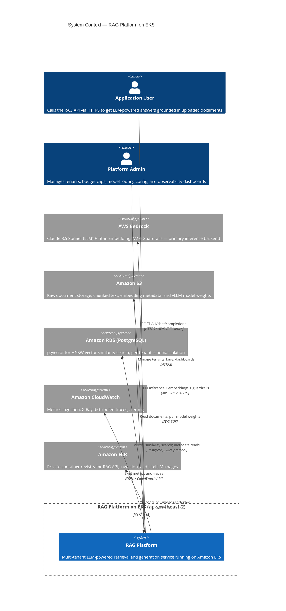

# System Context Diagram

C4 Level 1 view showing the external actors, system boundary, and AWS services that the RAG
Platform depends on. This diagram answers "what does the system interact with?" without describing
internal implementation details.

