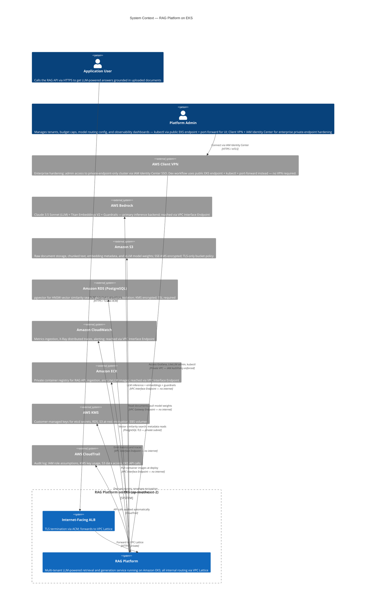

# System Context Diagram

C4 Level 1 view showing the external actors, system boundary, and AWS services that the RAG
Platform depends on. This diagram answers "what does the system interact with?" without describing
internal implementation details.

Application users reach the platform via HTTPS to an **internet-facing ALB** (not VPC Lattice
directly — VPC Lattice is private and handles east-west routing only). Platform admins connect
through **AWS Client VPN with IAM Identity Center** and reach internal tooling (Grafana, LiteLLM
admin UI) via the same VPC Lattice service network, scoped by IAM AuthPolicy.

All pod-to-AWS-service traffic flows via **VPC Interface/Gateway Endpoints** — Bedrock, ECR, S3,
STS, CloudWatch, SSM — so no RAG Platform traffic traverses the internet via NAT Gateway.

