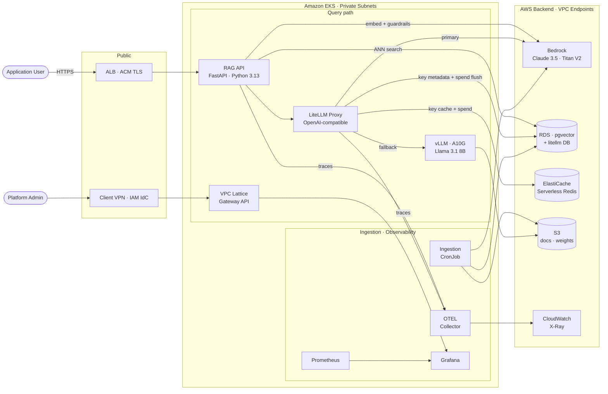

# Container Diagram

C4 Level 2 view showing the internal services, data stores, and their relationships within
the RAG Platform boundary. Each box represents a separately deployable unit (Kubernetes Deployment,
CronJob, or managed AWS service).

The diagram uses two horizontal rows inside the EKS boundary to separate concerns and keep
edges directional: the **query path** (top row) handles real-time requests; the **ingestion and
observability** path (bottom row) handles background pipeline and monitoring.

**Routing split:** ALB connects directly to the RAG API, bypassing VPC Lattice on the external
streaming path. VPC Lattice (Gateway API Controller) handles admin routing only (Grafana) and
internal service policy enforcement. This avoids VPC Lattice's 1-minute idle timeout, which
is incompatible with SSE streaming for long LLM responses.

Prometheus scrapes `/metrics` from all services (RAG API, LiteLLM, vLLM) — this scrape-back
relationship is omitted from the diagram to avoid backwards edges cluttering the layout.

