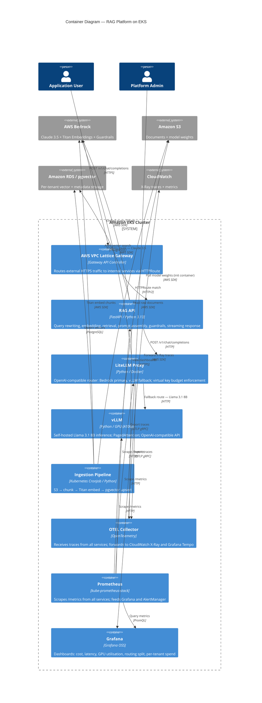

# Container Diagram

C4 Level 2 view showing the internal services, data stores, and their relationships within
the RAG Platform boundary. Each box represents a separately deployable unit (Kubernetes Deployment,
CronJob, or managed AWS service).

