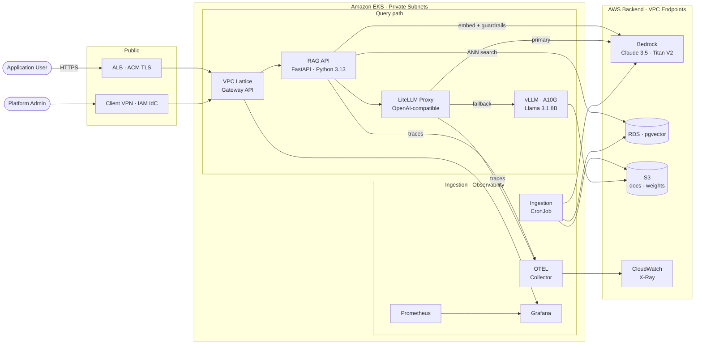

# Container Diagram

C4 Level 2 view showing the internal services, data stores, and their relationships within
the RAG Platform boundary. Each box represents a separately deployable unit (Kubernetes Deployment,
CronJob, or managed AWS service).

The diagram uses two horizontal rows inside the EKS boundary to separate concerns and keep
edges directional: the **query path** (top row) handles real-time requests; the **ingestion and
observability** path (bottom row) handles background pipeline and monitoring.

Prometheus scrapes `/metrics` from all services (RAG API, LiteLLM, vLLM) — this scrape-back
relationship is omitted from the diagram to avoid backwards edges cluttering the layout.

