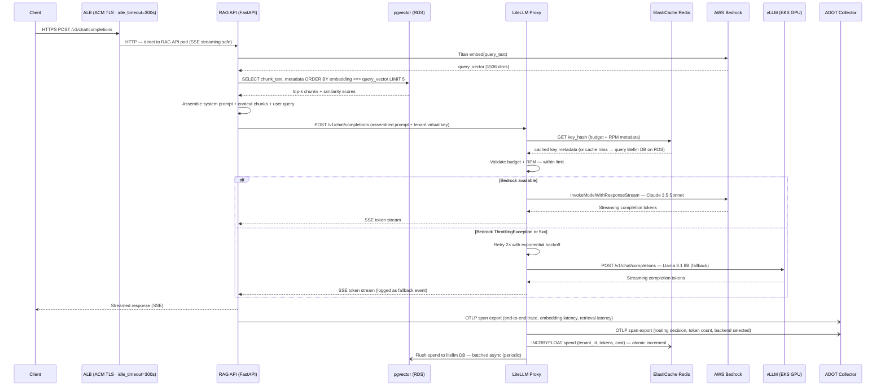

# RAG Query Request Flow

End-to-end sequence diagram for a single RAG query, from the client HTTP request through vector
retrieval, prompt assembly, LLM routing, and streaming response. Shows both the Bedrock success
path and the vLLM fallback path.

