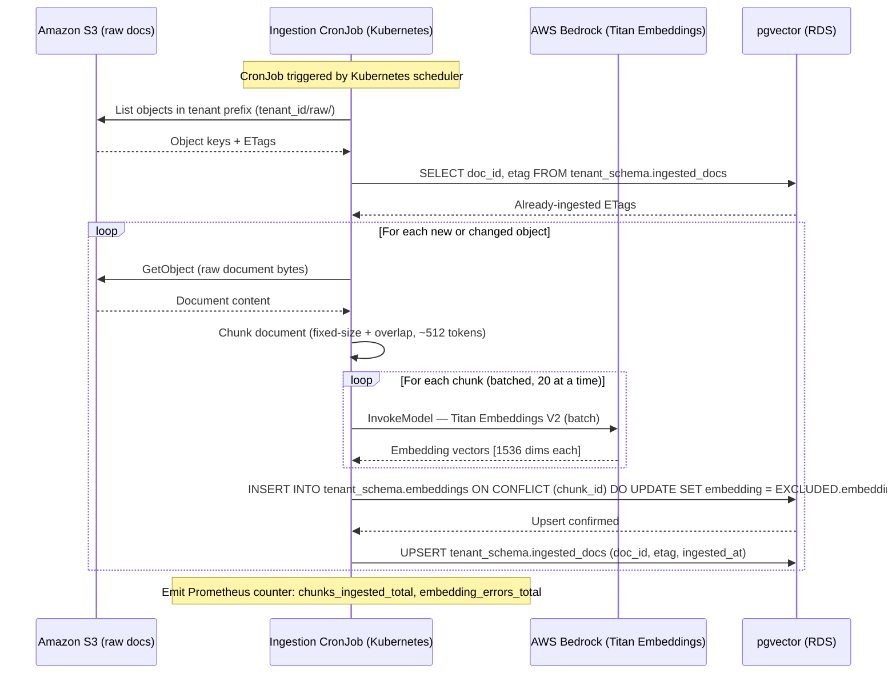

# Document Ingestion Pipeline Flow

Sequence diagram for the document ingestion CronJob: reading raw documents from S3, chunking,
embedding via Titan, and upserting into the pgvector index. Runs on a schedule and is idempotent
(re-ingesting the same document updates the existing vector, it does not create a duplicate).

