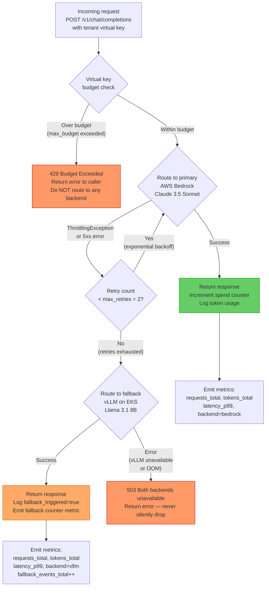

# LLM Routing Decision Tree

Flowchart showing how LiteLLM Proxy routes each request: budget check first, then primary
(Bedrock), then fallback (vLLM). Budget exhaustion and backend errors are distinct failure
modes — budget exhaustion does NOT trigger the fallback chain.

