# Infrastructure Diagram

AWS infrastructure topology: VPC layout, EKS node groups, RDS placement, VPC Lattice service
network, and S3. Shows network boundaries, how internet traffic enters via an internet-facing ALB
directly to RAG API pods (SSE streaming-safe, `idle_timeout=300s`), how VPC Lattice handles admin
routing only, how pods reach AWS services via VPC endpoints (no NAT for AWS API calls), and admin
access paths.

VPC Lattice is a **private, VPC-scoped service** used for admin routing (Grafana) and internal
service policy enforcement. It is NOT in the external request path — VPC Lattice's 1-minute idle
timeout is incompatible with SSE streaming for long LLM responses. External traffic goes ALB →
RAG API pods directly via TargetGroupBinding (AWS Load Balancer Controller). There is no
ALB → VPC Lattice path for the RAG API.

**Admin access — two tiers:**
- *Dev / single operator:* EKS public+private endpoint enabled. `aws eks update-kubeconfig` from
  laptop; `kubectl port-forward` for Grafana and LiteLLM admin UI. No VPN required.
- *Enterprise hardening:* Private endpoint only + AWS Client VPN + IAM Identity Center. Admins
  connect to the VPC then access internal services via VPC Lattice with IAM AuthPolicy.

```mermaid
graph TB
    subgraph Internet["Internet"]
        User((Application User))
        Admin((Platform Admin))
    end

    subgraph AWS["AWS ap-southeast-2"]

        subgraph AdminAccess["Admin Access"]
            PublicEP[EKS Public Endpoint\nkubectl from laptop\nIAM access entries]
            VPN[Client VPN + IAM Identity Center\nEnterprise hardening — private endpoint only]
        end

        subgraph VPC["VPC (10.0.0.0/16)"]

            subgraph PublicSubnets["Public Subnets (AZ-a, AZ-b, AZ-c)"]
                ALB[Internet-Facing ALB\nAWS Load Balancer Controller\nTLS termination via ACM]
                IGW[Internet Gateway]
            end

            subgraph PrivateSubnets["Private Subnets (AZ-a, AZ-b, AZ-c)"]

                VPCLattice[AWS VPC Lattice\nService Network\nEast-West routing only\nIAM AuthPolicy enforcement]

                subgraph EKS["EKS 1.35 Cluster (private endpoint)"]
                    subgraph CPUNodePool["CPU NodePool (AL2023)\nm5.xlarge / m5.2xlarge — Spot+OD"]
                        RAGPod[RAG API Pods\nPod SG: 443 to Bedrock EP\n5432 to RDS SG]
                        LiteLLMPod[LiteLLM Pods\nPod SG: 443 to Bedrock EP]
                        ObsPods[Prometheus / Grafana / ADOT\nAdmin access via VPN + VPC Lattice]
                    end
                    subgraph GPUNodePool["GPU NodePool (Bottlerocket Accelerated)\ng5.xlarge — Spot with OD fallback"]
                        vLLMPod[vLLM Pods\nA10G GPU]
                    end
                    subgraph SystemPods["System Pods"]
                        Karpenter[Karpenter]
                        KEDA[KEDA]
                        GatewayCtrl[Gateway API Controller]
                    end
                end

                subgraph NetworkPolicies["Kubernetes NetworkPolicies"]
                    NP1[default-deny-all ingress+egress\nper namespace]
                    NP2[allow rag-api → litellm:8000]
                    NP3[allow litellm → vllm:8000]
                end

                subgraph RDSSubnetGroup["RDS Subnet Group"]
                    RDS[(RDS PostgreSQL\npgvector — Multi-AZ\nKMS encrypted\nSSL required\nSG: port 5432 from pod SG)]
                end

                subgraph VPCEndpoints["VPC Endpoints (private AWS connectivity — no NAT)"]
                    EP_Bedrock[Bedrock Interface Endpoint\nbedrock-runtime]
                    EP_ECR[ECR Interface Endpoints\necr.api + ecr.dkr]
                    EP_S3[S3 Gateway Endpoint\nno-cost, route-table based]
                    EP_STS[STS Interface Endpoint\nrequired for Pod Identity]
                    EP_CW[CloudWatch Interface Endpoints\nlogs + monitoring]
                    EP_SSM[SSM Interface Endpoints\nssm + ssmmessages]
                end

            end
        end

        subgraph ManagedServices["AWS Managed Services"]
            Bedrock[AWS Bedrock\nClaude 3.5 + Titan\nGuardrails]
            S3[(Amazon S3\nDocuments + Weights\nSSE-KMS encrypted\nTLS-only bucket policy)]
            ECR[Amazon ECR\nContainer Images\nimmutable tags]
            CW[CloudWatch\nX-Ray + Metrics]
            SSM[SSM Parameter Store\nSecrets — no static creds]
            KMS[AWS KMS\nCustomer-managed keys\netcd / RDS / S3 / EBS]
            CloudTrail[CloudTrail\nAudit: KMS usage\nIAM assumptions\nS3 access]
        end

    end

    %% Internet ingress — ALB direct to RAG API pods (TargetGroupBinding), bypasses VPC Lattice
    User --> ALB
    ALB --> RAGPod

    %% Admin access — dev path: public EKS endpoint + kubectl port-forward
    Admin --> PublicEP
    PublicEP --> EKS
    %% Admin access — enterprise path: Client VPN → VPC Lattice → internal services
    Admin --> VPN
    VPN --> VPCLattice
    VPCLattice --> ObsPods

    %% Internet gateway supports ALB only (not pod egress)
    ALB --> IGW

    %% Internal service routing
    RAGPod --> LiteLLMPod
    LiteLLMPod --> vLLMPod
    RAGPod --> RDS
    LiteLLMPod --> RDS

    %% AWS service calls via VPC Endpoints — no NAT, no internet
    RAGPod --> EP_Bedrock
    LiteLLMPod --> EP_Bedrock
    RAGPod --> EP_CW
    RAGPod --> EP_SSM
    EKS --> EP_ECR
    EKS --> EP_S3
    EKS --> EP_STS

    %% Endpoints resolve to backend services
    EP_Bedrock --> Bedrock
    EP_ECR --> ECR
    EP_S3 --> S3
    EP_STS --> SSM
    EP_CW --> CW
    EP_SSM --> SSM

    %% KMS used by storage services
    KMS --> RDS
    KMS --> S3
    KMS --> EKS
```

