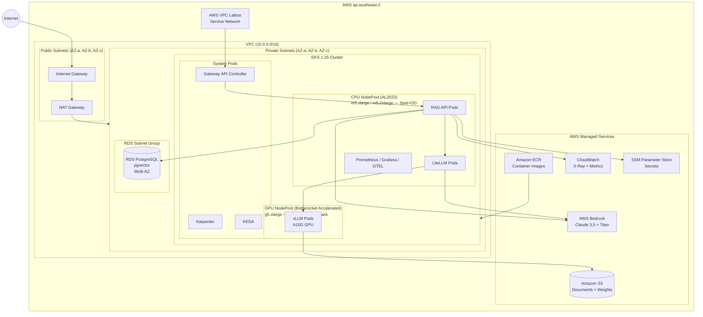

# Infrastructure Diagram

AWS infrastructure topology: VPC layout, EKS node groups, RDS placement, VPC Lattice service
network, and S3. Shows network boundaries and how components communicate across subnet tiers.

