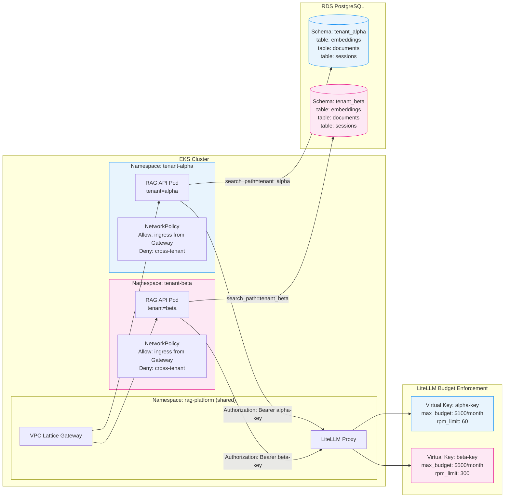

# Multi-Tenancy Isolation Model

Graph showing the three-layer tenant isolation model: Kubernetes namespace (compute),
PostgreSQL schema (data), and LiteLLM virtual key (budget). Each layer is independently
enforceable. See [ADR-007](../adr/ADR-007-multi-tenant-isolation-model.md) for the decision rationale.

