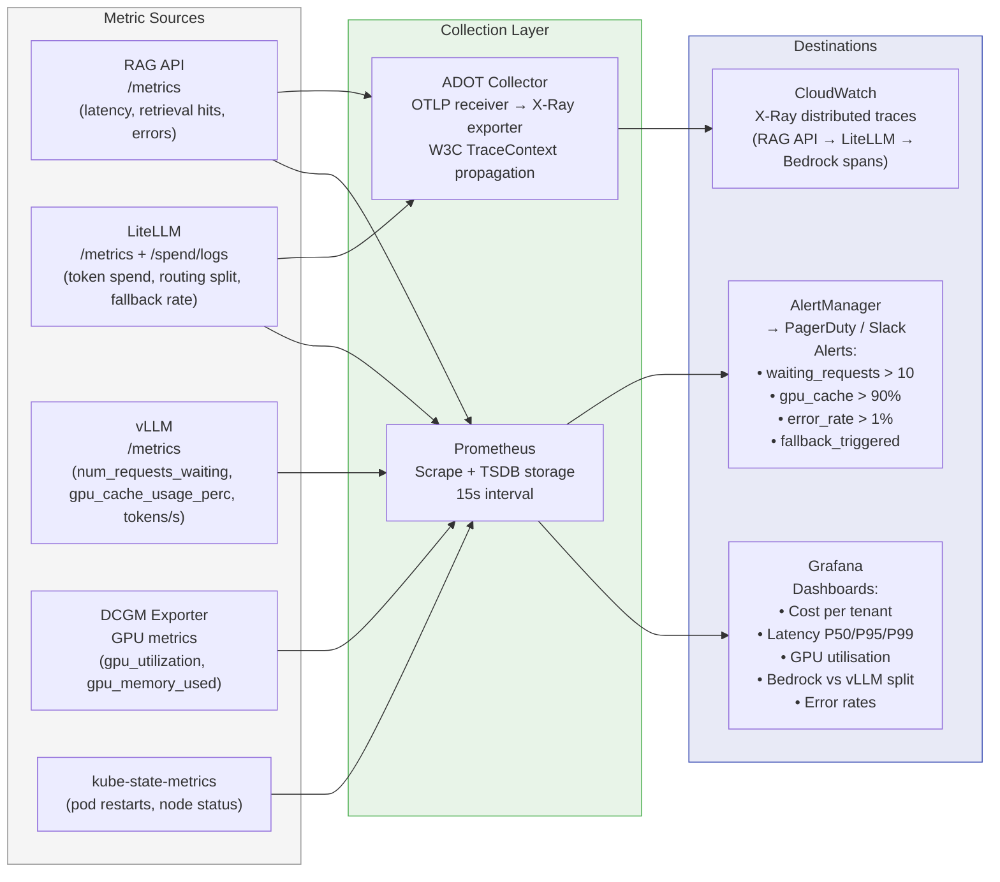

# Observability Pipeline

Flowchart showing the full observability pipeline: metric sources, collection layer, and
destinations. Covers the four golden signals (latency, traffic, errors, saturation) and
distributed tracing through to CloudWatch X-Ray.

